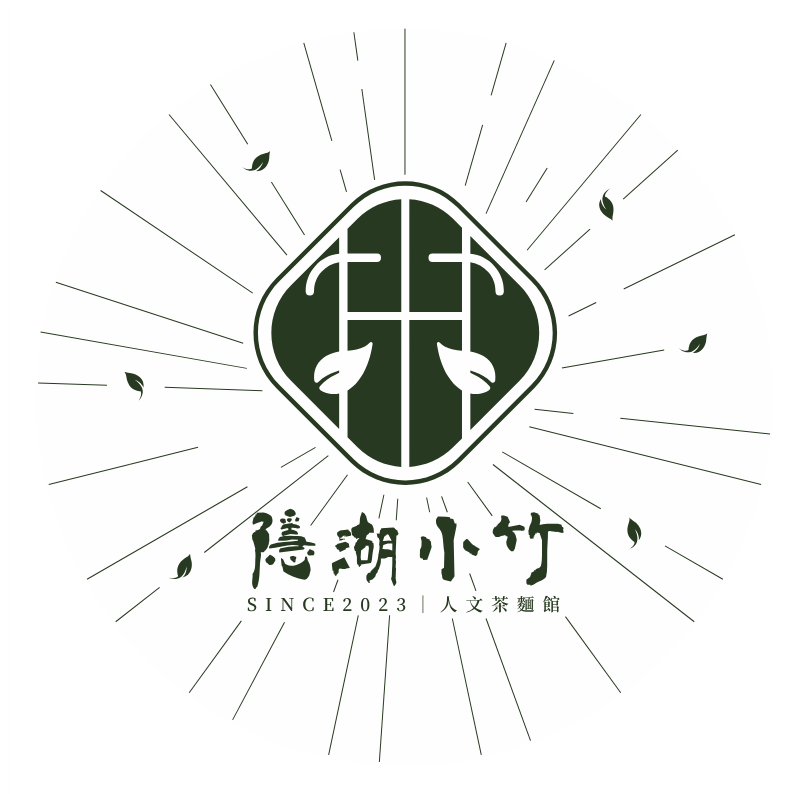

# 首頁 Hero Logo 設置指南

## 🎯 快速設置

我已經為您設置了首頁 hero 區塊的 logo 顯示。現在您只需要：

1. **將首頁 logo 圖片放到 `assets` 資料夾中**
2. **命名為 `home-logo.png`**

## 📁 Logo 檔案要求

### 檔案格式

- **推薦格式：** PNG（支援透明背景）
- **其他格式：** JPG, JPEG
- **檔案名稱：** `home-logo.png`

### 圖片規格

- **建議尺寸：** 800x400 像素或更大
- **形狀：** 橫向矩形（適合 hero 區塊）
- **背景：** 透明或深色背景
- **檔案大小：** 建議小於 1MB

### 與登入頁 logo 的區別

- **登入頁 logo：** `assets/logo.png` - 圓形，240x240 像素
- **首頁 logo：** `assets/home-logo.png` - 橫向，最大 400px 寬

## 🎨 Logo 顯示效果

### 當前設置

- **最大寬度：** 400px（桌面版）
- **形狀：** 圓角矩形（15px 圓角）
- **陰影：** 深色陰影效果
- **背景：** 半透明毛玻璃效果
- **位置：** 居中顯示

### 響應式設計

- **桌面版：** 最大 400px 寬
- **平板版：** 最大 300px 寬
- **手機版：** 最大 250px 寬

## 🔧 自訂選項

### 調整尺寸

```css
.hero-logo img {
  max-width: 500px; /* 調整最大寬度 */
}
```

### 調整圓角

```css
.hero-logo img {
  border-radius: 20px; /* 調整圓角大小 */
}
```

### 調整陰影

```css
.hero-logo img {
  box-shadow: 0 15px 40px rgba(0, 0, 0, 0.4); /* 調整陰影 */
}
```

### 移除毛玻璃效果

```css
.hero-logo img {
  background: transparent; /* 移除背景 */
  backdrop-filter: none; /* 移除毛玻璃效果 */
}
```

## 📱 響應式測試

### 桌面版測試

- 開啟開發者工具
- 設定螢幕尺寸為 1920x1080
- 檢查 logo 顯示

### 手機版測試

- 開啟開發者工具
- 設定螢幕尺寸為 375x667
- 檢查 logo 顯示

### 平板版測試

- 開啟開發者工具
- 設定螢幕尺寸為 768x1024
- 檢查 logo 顯示

## ✅ 測試步驟

1. 將 logo 圖片放到 `assets` 資料夾
2. 開啟 `index.html` 查看效果
3. 測試不同螢幕尺寸的響應式效果
4. 確認 logo 清晰度和載入速度

## 🎨 設計建議

### 適合首頁的 logo 設計

- **橫向設計** - 適合 hero 區塊的寬度
- **高對比度** - 在深色背景上清晰可見
- **簡潔設計** - 避免過於複雜的細節
- **品牌一致性** - 與登入頁 logo 保持風格一致

### 顏色建議

- **主色調：** 深綠色（#2d5a27）
- **輔助色：** 白色、淺綠色
- **避免：** 過於鮮豔的顏色

## 🔄 備用方案

如果 logo 載入失敗，會顯示預設的文字：

```html
<div class="hero-logo">
  隱湖小竹<br>人文茶麵館</h1>';"
  />
</div>
```

## 📞 如果遇到問題

### 常見問題

1. **圖片不顯示**

   - 檢查檔案路徑是否正確
   - 確認檔案格式是否支援

2. **圖片太大或太小**

   - 調整 CSS 中的 `max-width` 設定

3. **響應式效果不佳**
   - 檢查不同螢幕尺寸的設定

### 需要協助

如果遇到問題，請提供：

- 瀏覽器資訊
- 錯誤訊息
- 圖片檔案資訊
